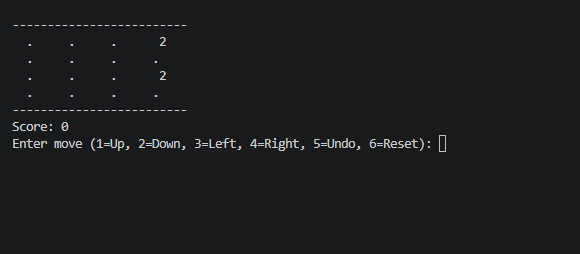
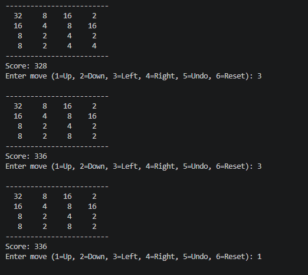
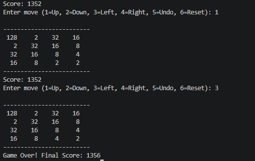

# 2048 Console Game 🎮

A terminal-based implementation of the classic 2048 puzzle game, written entirely in C. This project allows users to play the popular sliding tile puzzle directly from their command line.

## 🚀 Features
* **Classic Gameplay:** Slide and merge matching tiles to reach the 2048 tile.
* **Simple Controls:** Control the board using simple numeric inputs:
  * `1` = Up
  * `2` = Down
  * `3` = Left
  * `4` = Right
* **Undo Move:** Made a mistake? Press `5` to undo your last move and restore the previous state and score.
* **Reset Game:** Press `6` to instantly restart the game at any point.
* **Score Tracking:** Real-time score updates as you combine tiles.

## 📸 Screenshots

**1. Initial Game State**


**2. Gameplay & Score Tracking**


**3. Game Over Screen**


## 🛠️ Technologies Used
* **Language:** C Programming Language
* **Core Concepts:** 2D Arrays, Pointers, Game Loops, Memory Management (State Saving).

## 💻 How to Run

1. Make sure you have a C compiler installed (like GCC).
2. Open your terminal or command prompt.
3. Navigate to the directory where the file is located.
4. Compile the code using the following command:
   ```bash
   gcc "2048 Game.C" -o 2048_game
